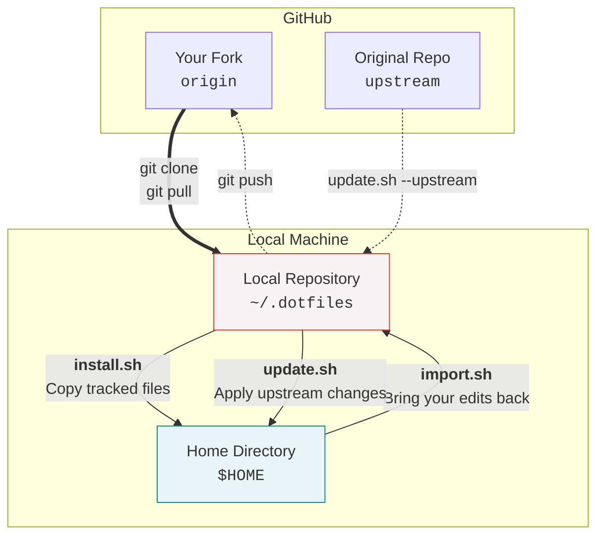

# dotfiles

XDG-compliant dotfiles for a WSL2 Ubuntu 26.04 zsh dev environment.
Companion to [docs/Ubuntu-26.04-devcli.user-data](docs/Ubuntu-26.04-devcli.user-data) (cloud-init provisioning).

Designed to be **forked and customised** — see [Workflows](#workflows) below.

## Concept

The default WSL 2 experience leaves a lot to be desired. These dotfiles aim to:

- **Automate** WSL distro provisioning (cloud-init) and dotfiles deployment in one step
- **Work out of the box** — zero manual config needed for a comfortable baseline
- **Stay easy to customise** — minimal dependencies, readable configs, clear structure

The result is a modern-by-default dev environment that you can adapt to your own taste.

## What's included

- **Login shell: [Zsh 5.9](https://packages.ubuntu.com/resolute/zsh) (resolute/main)**
  - Config split by role into [`conf.d/*.zsh`](.config/zsh/conf.d/) files, sourced in numeric order
  - `Ctrl-r` — fzf [command history](.config/zsh/conf.d/31-fzf.zsh) search
  - `Ctrl-s` — fzf [recent-directory](.config/zsh/conf.d/31-fzf.zsh) search
  - [SSH agent auto-start](.config/zsh/conf.d/31-ssh-agent.zsh)
  - [tmux auto-start](.config/zsh/conf.d/91-tmux.zsh)
  - Only zsh-users plugins: `zsh-completions`, `zsh-autosuggestions`,
    `zsh-syntax-highlighting`, `zsh-history-substring-search` —
    auto-cloned to `${XDG_DATA_HOME}/zsh/plugins` on first shell start; no framework, no submodules
- **No Zsh framework**
- **Prompt: [Starship 1.22.1](https://packages.ubuntu.com/resolute/starship) (resolute/universe)**
  - configured at [`.config/starship.toml`](.config/starship.toml), Powerlevel10k classic style
- **Package management: [apt](https://packages.ubuntu.com/resolute/apt) + [mise](https://mise.jdx.dev/)**
  - Ubuntu official repos by default; [mise](.config/mise/config.toml) available when you need
    the latest version of a tool
- **Terminal multiplexer: [tmux 3.6](https://packages.ubuntu.com/resolute/tmux) (resolute/main)**
  - config at [`.config/tmux/tmux.conf`](.config/tmux/tmux.conf); prefix key is `Alt-f`;
    `Prefix Shift-P` opens/detaches a popup shell
- **VCS: [git](https://git-scm.com/install/linux) (PPA) + [GitHub CLI](https://docs.github.com/en/github-cli/github-cli/quickstart) (mise)**
  - default config at [`.config/git/config`](.config/git/config)
- **Coding assistant: [Claude Code](https://docs.anthropic.com/en/docs/claude-code/)**
  - settings and skills under [`.claude/`](.claude/); includes a practical
    [status-line script](.claude/statusline-command.sh) and the `fcc` alias
    ([`22-aliases.zsh`](.config/zsh/conf.d/22-aliases.zsh)) to copy Claude Code conversation
    history to the clipboard as Markdown
- **Misc**
  - [XDG Base Directory](.config/zsh/conf.d/11-xdg.zsh) layout throughout
  - Lightweight replacements for the deprecated [wslu](https://github.com/wslutilities/wslu)
    utilities: [`wslvar`](.local/bin/wslvar) and [`wslview`](.local/bin/wslview)
    (the standard `wslpath` is not deprecated)
  - Minimal [vim config](.config/vim/vimrc)
- **Copy-based installer** — `install.sh` copies files from the repo into `$HOME`, prompts for
  confirmation (or pass `-y`), and migrates old symlink-based installs automatically.
  `--clean` removes files dropped from the repo. New tracked files are picked up on the next
  `install.sh` run without any manual wiring.

## Architecture



| Script       | Purpose                                          |
| ------------ | ------------------------------------------------ |
| `install.sh` | Copy tracked files from the repo into `$HOME`    |
| `import.sh`  | Bring edits made in `$HOME` back into the repo   |
| `update.sh`  | Pull the latest commits and re-copy into `$HOME` |

## Directory structure

```
.dotfiles/
├── .zshenv                   # Sets ZDOTDIR; sourced first by zsh
├── .config/
│   ├── zsh/
│   │   ├── .zshrc            # Sources conf.d/*.zsh in order
│   │   └── conf.d/           # Modular config fragments (NN-name.zsh)
│   ├── git/config            # Git config
│   ├── starship.toml         # Starship prompt config
│   ├── mise/config.toml      # mise global tools + settings
│   ├── tmux/
│   │   ├── tmux.conf
│   │   ├── tmux-popup.conf
│   │   └── tmux-popup.sh
│   └── vim/vimrc
├── .claude/                  # Claude Code settings and custom skills
├── .local/bin/               # WSL helper scripts
├── docs/
│   ├── Ubuntu-26.04-devcli.user-data  # cloud-init user-data for WSL setup
│   ├── windows-setup.md               # Finishing the Windows setup (manual)
│   └── ubuntu-pro-for-wsl.md          # Ubuntu Pro for WSL setup (optional)
├── windows/
│   ├── setup.ps1             # Windows 11 base setup script
│   └── packages.csv          # winget package list for setup.ps1
├── lib.sh                    # Shared helpers (sourced by the scripts below)
├── install.sh                # Copy repo files into $HOME
├── update.sh                 # Pull latest + re-copy (respects local edits)
├── import.sh                 # Push $HOME edits back into the repo
└── uninstall.sh              # Remove the repo clone
```

## Requirements

- **zsh**, **git** (required)
- **starship**, **mise**, **tmux**, **vim**, **fzf** (optional; all provisioned
  by the cloud-init `packages:` list in [docs/Ubuntu-26.04-devcli.user-data](docs/Ubuntu-26.04-devcli.user-data))

## Setup

### Provisioning a fresh WSL machine

Follow these steps in order:

1. **Prepare Windows 11** — run `windows/setup.ps1` (see below)
2. **(optional) Finish the Windows setup** — font, VS Code, git identity →
   [docs/windows-setup.md](docs/windows-setup.md)
3. **(optional) Enable Ubuntu Pro for WSL** →
   [docs/ubuntu-pro-for-wsl.md](docs/ubuntu-pro-for-wsl.md)
4. **(optional) Fork this repo and update the two references** →
   see [Workflows › Fork-based](#fork-based-recommended-for-customisation)
5. **Start the WSL distro** from PowerShell:

   ```powershell
   wsl --install -d Ubuntu-26.04 --name Ubuntu-26.04-devcli
   ```

   cloud-init picks up
   [docs/Ubuntu-26.04-devcli.user-data](docs/Ubuntu-26.04-devcli.user-data) automatically,
   installs packages, clones the repo, and runs `install.sh -y`.

#### Step 1 in detail — Prepare Windows 11

Run [windows/setup.ps1](windows/setup.ps1) on the Windows host. It:

- Enables WSL
- Installs Windows Terminal, Git for Windows, and VS Code via winget
  (package list in [windows/packages.csv](windows/packages.csv))
- Installs the PlemolJP NF console font
- Places `~\.cloud-init\Ubuntu-26.04-devcli.user-data` so WSL picks it up automatically

```powershell
# Download and inspect, then run
irm https://raw.githubusercontent.com/yokarikeri/dotfiles/refs/heads/main/windows/setup.ps1 -OutFile setup.ps1
powershell -ExecutionPolicy Bypass -File .\setup.ps1
```

### Installing on an existing machine

```sh
git clone https://github.com/yokarikeri/dotfiles.git ~/.dotfiles
sh ~/.dotfiles/install.sh
```

A confirmation prompt lists the files to be copied. Pass `-y` to skip it
(useful in scripts and cloud-init):

```sh
sh ~/.dotfiles/install.sh -y
```

Open a new shell. On first start, missing zsh plugins are cloned automatically.

Re-running `install.sh` is safe — it overwrites managed files and migrates any
old symlinks to real files.

## Usage

### Editing config

Config files are plain copies in `$HOME`. Editing them does **not** affect the
repo. To send your edits back to the repo, use `import.sh`.

```sh
# After editing ~/.config/zsh/conf.d/22-aliases.zsh, for example:
sh ~/.dotfiles/import.sh
```

`import.sh` copies changed files into the repo, shows `git diff`, and prints
the commands to commit and push. It does not commit anything automatically.

### Adding a new dotfile

1. Add the file to the repo under its `$HOME`-relative path and `git add` it.
2. Re-run `sh install.sh` to copy it to `$HOME`.

No manual wiring in `install.sh` is needed — `install.sh` auto-discovers all
git-tracked files under `.zshenv`, `.config/`, `.claude/`, and `.local/bin/`.

### Managing tools with mise

```sh
mise use -g <tool>@<version>   # install and add to global config
mise ls                        # list installed tools
mise upgrade                   # upgrade all tools
```

The global config at `.config/mise/config.toml` contains a commented-out
catalogue of tools to choose from, along with a quick-reference cheatsheet.

## Workflows

### Fork-based (recommended for customisation)

Fork this repo on GitHub, then update these two references to point to your fork:

- [`docs/Ubuntu-26.04-devcli.user-data`](docs/Ubuntu-26.04-devcli.user-data) line ~185 — the `git clone` URL used by cloud-init
- [`windows/setup.ps1`](windows/setup.ps1) `$RepoBase` variable — the raw URL base used to fetch `packages.csv` and the user-data file

**Initial setup**

```sh
# Clone your fork
git clone https://github.com/<you>/dotfiles.git ~/.dotfiles

# Add the upstream repo so you can pull improvements later
git -C ~/.dotfiles remote add upstream https://github.com/yokarikeri/dotfiles.git

# Copy files into $HOME
sh ~/.dotfiles/install.sh
```

**Daily use**

```sh
# After editing config files in $HOME, import them into the repo:
sh ~/.dotfiles/import.sh
# Then review git diff, commit, and push:
cd ~/.dotfiles && git add -p && git commit -m "…" && git push
```

**Pulling upstream improvements**

```sh
# Fetch and merge changes from the original repo, then re-copy:
sh ~/.dotfiles/update.sh --upstream
```

Files you have edited locally ("diverged" files) are **not** overwritten —
their upstream diff is shown instead. Apply small changes manually; for larger
changes, run `import.sh` first to commit your version, then merge.

**Syncing your fork to another machine**

```sh
# On the second machine after cloning your fork and running install.sh:
sh ~/.dotfiles/update.sh   # pulls from your fork's origin
```

### Direct use (no fork)

Use as-is when you just want the config without maintaining a personal fork.

```sh
git clone https://github.com/yokarikeri/dotfiles.git ~/.dotfiles
sh ~/.dotfiles/install.sh
```

**Pulling updates**

```sh
sh ~/.dotfiles/update.sh
```

Files you have edited locally are not overwritten — their diff is shown and
you can decide whether to apply the upstream changes manually.

## Uninstall

```sh
sh ~/.dotfiles/uninstall.sh
```

Removes the `~/.dotfiles` repo clone after confirmation. Config files that were
copied to `$HOME` are **not** touched — your environment keeps working.

## Notes

- **WSL PATH**: `appendWindowsPath` is disabled in the WSL config to prevent Windows
  paths from bloating `$PATH` and slowing down shell completion. A thin wrapper
  [`.config/zsh/conf.d/12-wsl.zsh`](.config/zsh/conf.d/12-wsl.zsh) provides
  convenient access to Windows-side tools without the noise. (`WSLENV` is not
  used — it adds complexity without meaningful benefit in this setup.)

  > [!TIP]
  > The list of distro names that `wsl --install -d` recognises is at
  > <https://github.com/microsoft/WSL/blob/master/distributions/DistributionInfo.json>.

- Commit and comment conventions are in `CLAUDE.md`.
